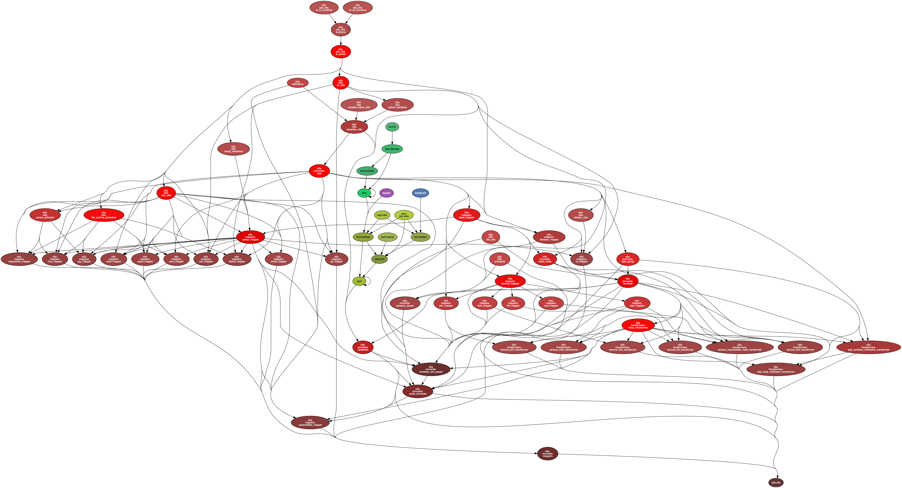

<!--
  Copyright 2019 Google LLC

  Licensed under the Apache License, Version 2.0 (the "License");
  you may not use this file except in compliance with the License.
  You may obtain a copy of the License at

  http://www.apache.org/licenses/LICENSE-2.0

  Unless required by applicable law or agreed to in writing, software
  distributed under the License is distributed on an "AS IS" BASIS,
  WITHOUT WARRANTIES OR CONDITIONS OF ANY KIND, either express or implied.
  See the License for the specific language governing permissions and
  limitations under the License.
 -->

Table of Contents
=================

<!-- START doctoc generated TOC please keep comment here to allow auto update -->
<!-- DON'T EDIT THIS SECTION, INSTEAD RE-RUN doctoc TO UPDATE -->


- [How to Contribute](#how-to-contribute)
  - [Contributor License Agreement](#contributor-license-agreement)
  - [Code reviews](#code-reviews)
  - [Community Guidelines](#community-guidelines)
- [Architecture of the solution](#architecture-of-the-solution)
- [Local development environment](#local-development-environment)
  - [Local environment setup](#local-environment-setup)
  - [Static code analysis and pre-commit hooks](#static-code-analysis-and-pre-commit-hooks)
  - [Running Unit Tests](#running-unit-tests)
  - [Running all example conversions](#running-all-example-conversions)
  - [Dependency graphs](#dependency-graphs)
- [Continuous integration environment](#continuous-integration-environment)
- [Cloud test environment with Dataproc and Composer](#cloud-test-environment-with-dataproc-and-composer)
  - [Cloud environment setup](#cloud-environment-setup)
  - [Running system tests](#running-system-tests)

<!-- END doctoc generated TOC please keep comment here to allow auto update -->

# How to Contribute

We'd love to accept your patches and contributions to this project. There are
just a few small guidelines you need to follow.

## Contributor License Agreement

Contributions to this project must be accompanied by a Contributor License
Agreement. You (or your employer) retain the copyright to your contribution;
this simply gives us permission to use and redistribute your contributions as
part of the project. Head over to <https://cla.developers.google.com/> to see
your current agreements on file or to sign a new one.

You generally only need to submit a CLA once, so if you've already submitted one
(even if it was for a different project), you probably don't need to do it
again.

## Code reviews

All submissions, including submissions by project members, require review. We
use GitHub pull requests for this purpose. Consult
[GitHub Help](https://help.github.com/articles/about-pull-requests/) for more
information on using pull requests.

## Community Guidelines

See [Code of Conduct](CODE_OF_CONDUCT.md)

# Architecture of the solution

The latest documentation about design of Oozie To Airflow converter can be found in
[The Design Document](https://docs.google.com/document/d/1DmXn7iAj0H0eekiPBCDTH_VgN4jC8wWF7N-XLkejNj0/edit).
Please take a look to understand how the conversion process works.

# Local development environment

You can easily setup your local environment to modify the code and run tests and conversions.
The unit tests and conversion can be all run locally and they do not require Oozie-enabled cluster nor
running Apache Airflow instance.

## Local environment setup

The environment can be setup via the virtualenv setup
(you can create one using [virtualenvwrapper](https://virtualenvwrapper.readthedocs.io/en/latest/)
for example.

While in your virtualenv, you can install all the requirements via `pip install -r requirements.txt`.

You can add the [bin](bin) subdirectory to your
PATH, then all the scripts below can be run without adding `./bin` prefix.
This can be done for example by adding similar line to your `.bash_profile`
or `bin/postactivate` from your virtual environment:

```bash
export PATH=${PATH}:<INSERT_PATH_TO_YOUR_OOZIE_PROJECT>/bin
```

Otherwise you need to run all the scripts from the bin subdirectory, for example:

```bash
./bin/o2a --help
```

In all the example commands below it is assumed that the [bin](bin) directory is in your PATH.

## Static code analysis and pre-commit hooks

We are using a number of checks for quality checks of the code. They are verified during Travis build but
also you can install:

Pre-commit hook by running:

`pre-commit install`

Pre-push hook by running:

`pre-commit install --hook-type pre-push`

You can also run all the checks manually by running:

`pre-commit run --all-files`

You might need to install xmllint and docker if you do not have it locally. The first can be done with
`apt install libxml2-utils` on Linux or `brew install xmlstarlet` on MacOS. The second can be done
according to [the instructions](https://docs.docker.com/install/).

You can always skip running the tests by providing `--no-verify` flag to `git commit` command.

You can check all commands of pre-commit framework at https://pre-commit.com/

## Running Unit Tests

While you are in your local virtualenv, you can run the unit tests. Currently, the test directory is
set up in a such a way that the folders in [tests](tests) directory mirrors the
structure of the [o2a](o2a) directory.

Unit tests are run automatically in Travis CI and when you have pre-commit hooks installed.
You can also run all unit tests using [o2a-run-all-unit-tests](bin/o2a-run-all-unit-tests) script.

## Running all example conversions

All example conversions can by run via the [o2a-run-all-conversions](bin/o2a-run-all-conversions) script.
It is also executed during automated tests.

## Dependency graphs

You can generate dependency graphs automatically from the code via
[o2a-generate-dependency-graph](bin/o2a-generate-dependency-graph) but you need `graphviz` installed locally.

The latest dependencies generated:


You can also see dependency cycles in case there are some cycles in
[o2a-dependency-cycles.png](images/o2a-dependecy-cycles.png)

# Continuous integration environment

The project integrates with Travis CI. To enable saving of the build process artifacts, you must configure the authorization mechanisms for Google Cloud Storage. For this purpose, it is necessary to set two environment variables: `GCP_SERVICE_ACCOUNT`, `GCP_BUCKET_NAME`.

To do this, follow these steps:
1. To simplify the instructions, set the environment variable:
```bash
export PROJECT_ID="$(gcloud config get-value project)"
export ACCOUNT_NAME=o2a-build-artifacts-travis-ci
export ACCOUNT_EMAIL="${ACCOUNT_NAME}@${PROJECT_ID}.iam.gserviceaccount.com"
export BUCKET_NAME=o2a-build-artifacts
```

2. Create the service account that will be used by Travis
```bash
gcloud iam service-accounts create "${ACCOUNT_NAME}"
```

3. Create a new private key for the service account, and save a copy of it in the `o2a-build-artifacts-sa.json` file.
```bash
gcloud iam service-accounts keys create --iam-account "${ACCOUNT_EMAIL}" o2a-build-artifacts-sa.json
```

4. Create the bucket
```bash
gsutil mb "gs://${BUCKET_NAME}"
```

5. Enables the Bucket Policy Only feature on Cloud Storage bucket
```bash
gsutil bucketpolicyonly set on "gs://${BUCKET_NAME}"
```

6. Grant permission to make a bucket's objects publicly readable:
```bash
gsutil iam ch allUsers:objectViewer "gs://${BUCKET_NAME}"
```

7. Grant permission to create and overwrite a bucket's objects by service account:
```bash
gsutil iam ch "serviceAccount:${ACCOUNT_EMAIL}:objectAdmin" "gs://${BUCKET_NAME}"
```

8. Set environement variable on Travis CI
```bash
travis env set GCP_SERVICE_ACCOUNT "$(cat o2a-build-artifacts-sa.json)" --private
travis env set GCP_BUCKET_NAME "${BUCKET_NAME}" --public
```

9. Remove a service account from local disk
```bash
rm o2a-build-artifacts-sa.json
```


# Cloud test environment with Dataproc and Composer

## Cloud environment setup

An easy way of testing changes to the oozie-to-airflow converter is by using  Cloud Composer and Dataproc.
These services allow testing without much need for an on-premise setup. Here are some details about the
environment:

### Cloud Composer

* composer-1.5.0-airflow-1.10.1
* python version 3 (3.6.6)
* machine n1-standard-1
* node count: 3
* Additional PyPi packages:
    * sshtunnel==0.1.4

### Cloud Dataproc Cluster with Oozie

* n1-standard-2, 4 vCPU, 20 GB memory (! Minimum 16 GB RAM needed)
* primary disk size, 50 GB
* Image 1.3.29-debian9
* Hadoop version
* Init action: [oozie-5.1.sh](dataproc/oozie-5.1.sh)

Those are the steps you should follow to set it up:

1. Create a Dataproc cluster see [Creating Dataproc Cluster](#creating-dataproc-cluster) below
1. Create a [Cloud Composer Environment](https://cloud.google.com/composer/docs/how-to/managing/creating#creating_a_new_environment)
   with at least Airflow version 1.10 to test the Apache Airflow workflows.
   Since Airflow 1.10 is in  Beta for Cloud Composer, you must
   [enable beta features in Cloud Console](https://cloud.google.com/composer/docs/concepts/beta-support#enable-beta))
1. Set up all required [Airflow Connections](https://airflow.apache.org/howto/manage-connections.html)
   in Composer. This is required for things like `SSHOperator`.

### Creating Dataproc cluster

We prepared Dataproc [initialization action](https://cloud.google.com/dataproc/docs/concepts/configuring-clusters/init-actions)
that allows to run Oozie 5.1.0 on Dataproc.

Please upload [oozie-5.1.sh](dataproc/oozie-5.1.sh) to your GCS bucket and create cluster using following command:

Note that you need at least 20GB RAM to run Oozie jobs on the cluster. The custom machine type below has enough RAM
to handle oozie.

```bash
gcloud dataproc clusters create <CLUSTER_NAME> --region europe-west1 --subnet default --zone "" \
     --single-node --master-machine-type custom-4-20480 --master-boot-disk-size 500 \
     --image-version 1.3-deb9 --project polidea-airflow --initialization-actions 'gs://<BUCKET>/<FOLDER>/oozie-5.1.sh' \
     --initialization-action-timeout=30m
```

**Note 1:** it might take ~20 minutes to create the cluster
**Note 2:** the init-action works only with [single-node cluster](https://cloud.google.com/dataproc/docs/concepts/configuring-clusters/single-node-clusters)
  and Dataproc 1.3

Once cluster is created, steps from [example map reduce job](dataproc/example-map-reduce-job.sh) can be
run on master node to execute Oozie's example Map-Reduce job.

Oozie is serving web UI on port 11000. To enable access to it please follow
[official instructions](https://cloud.google.com/dataproc/docs/concepts/accessing/cluster-web-interfaces)
on how to connect to the cluster web interfaces.

List of jobs with their statuses can be also shown by issuing `oozie jobs` command on master node.

## Running system tests

### System tests

Oozie to Airflow has a set of system tests that test end-2-end functionality of conversion and execution
of workflows using Cloud environment with Cloud Dataproc and Cloud Composer.

We can run examples defined in the [examples](examples) folder as system tests. The system tests
use an existing Composer, Dataproc cluster and Oozie run in the Dataproc cluster to prepare HDFS
application folder structure and trigger the tests automatically.

You can run the tests using this command:

`o2a-run-sys-tests --application <APPLICATION> --phase <PHASE>`

Default phase is convert - it only converts the oozie workflow to Airflow DAG without running the tests
on either Oozie nor Composer

When you run the script with `--help` you can see all the options. You can setup autocomplete
with `-A` option - this way you do not have to remember all the options.

Current options:

```
Usage: o2a-run-sys-test [FLAGS] [-A|-S|-K|-W]

Executes prepare or run phase for integration testing of O2A converter.

Flags:

-h, --help
        Shows this help message.

-a, --application <APPLICATION>
        Application (from examples dir) to run the tests on. Must be specified unless -S or -A are specified.
        One of [childwf decision demo el fs git mapreduce pig shell spark ssh subwf]

-p, --phase <PHASE>
        Phase of the test to run. One of [prepare-configuration convert prepare-dataproc test-composer test-oozie test-compare-artifacts]. Defaults to convert.

-C, --composer-name <COMPOSER_NAME>
        Composer instance used to run the operations on. Defaults to o2a-integration

-L, --composer-location <COMPOSER_LOCATION>
        Composer locations. Defaults to europe-west1

-c, --cluster <CLUSTER>
        Cluster used to run the operations on. Defaults to oozie-51

-b, --bucket <BUCKET>
        Airflow Composer DAG bucket used. Defaults to bucket that is used by Composer.

-r, --region <REGION>
        GCP Region where the cluster is located. Defaults to europe-west3

-v, --verbose
        Add even more verbosity when running the script.

-d, --dot
        Creates files in the DOT representation.
        If you have the graphviz program in PATH, the files will also be converted to the PNG format.
        If you have the graphviz program and the imgcat programs in PATH, the files will also be displayed in the console

Optional commands to execute:

-K, --ssh-to-composer-worker
        Open shell access to Airflow's worker. This allows you to test commands in the context of the Airflow instance.
        It is worth noting that it is possible to access the database.
        The kubectl exec command is used internally, so not all SSH features are available.

-S, --ssh-to-dataproc-master
        SSH to Dataproc's cluster master. All SSH features are available by this options.
        Arguments after -- are passed to gcloud compute ssh command as extra args.

-W, --open-oozie-web-ui
        Creates a SOCKS5 proxy server that redirects traffic through Dataproc's cluster master and
        opens Google Chrome with a proxy configuration and a tab with the Oozie web interface.

-A, --setup-autocomplete
        Sets up autocomplete for o2a-run-sys-tests

```

### Caching latest used parameters by run-sys-test

You do not need to specify the parameters once you run the script with your chosen flags.
The latest parameters used are stored and cached locally in .ENVIRONMENT_NAME files in
[.o2a-run-sys-test-cache-dir](.o2a-run-sys-test-cache-dir) and used next time when you run the script.

In case you want to clean up the cache, simply remove all the files from that directory.

### Test phases

The following phases are defined for the system tests:

* **prepare-configuration** - prepares configuration based on passed Dataproc/Composer parameters

* **convert** - converts the example application workflow to DAG and stores it in ``output/<APPLICATION>``
  directory

* **prepare-dataproc** - prepares Dataproc cluster to execute both Composer and Oozie jobs. The preparation is:

   * Local filesystem: `${HOME}/o2a/<APPLICATION>` directory contains application to be uploaded to HDFS

   * Local filesystem: `${HOME}/o2a/<APPLICATION>.properties` property file to run the oozie job

   * HDFS: /user/${user.name}/examples/apps/<APPLICATION> - the application is stored in this HDFS directory

* **test-composer** - runs tests on Composer instance. Artifacts are downloaded to the
 ``output-artifacts/<APPLICATION>/composer`` directory.

* **test-oozie** - runs tests on Oozie in Hadoop cluster. Artifacts are downloaded to the
  ``output-artifacts/<APPLICATION>/oozie`` directory.

* **test-compare-artifacts** - run tests on Oozie and Composer instance and displays a comparison of artifact
  differences.

### Test scenarios

The typical scenario to run the tests are:

Running application via Oozie:
```
o2a-run-sys-test --phase prepare-dataproc --application <APP> --cluster <CLUSTER>

o2a-run-sys-test --phase test-oozie
```

Running application via composer:
```
o2a-run-sys-test --phase prepare-dataproc --application <APP> --cluster <CLUSTER>

o2a-run-sys-test --phase test-composer
```

### Running system tests with sub-workflows

In order to run system tests with sub-workflows you need to have the sub-workflow application already
present in HDFS, therefore you need to run at least
`o2a-run-sys-test --phase prepare-dataproc --application <SUBWORKFLOW_APP>`

For example in case of the demo application, you need to run at least once
`o2a-run-sys-test --phase prepare-dataproc --application childwf` because `childwf` is used as sub-workflow
in the demo application.

### Packaging the application and uploading to PyPi

In order to upload a new version to PyPi you need to have the appropriate credentials. There are scripts that
package the application and upload it to the test or to the production PyPi instance:

* [o2a-package-upload-test](bin/o2a-package-upload-test) - prepares and uploads the prepared package to the test PyPi
* [o2a-package-upload](bin/o2a-package-upload) - prepares and uploads the prepared package to the production PyPi

Make sure to update the version of the package in [setup.py](setup.py) before preparing/updating.
