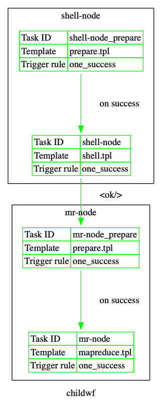
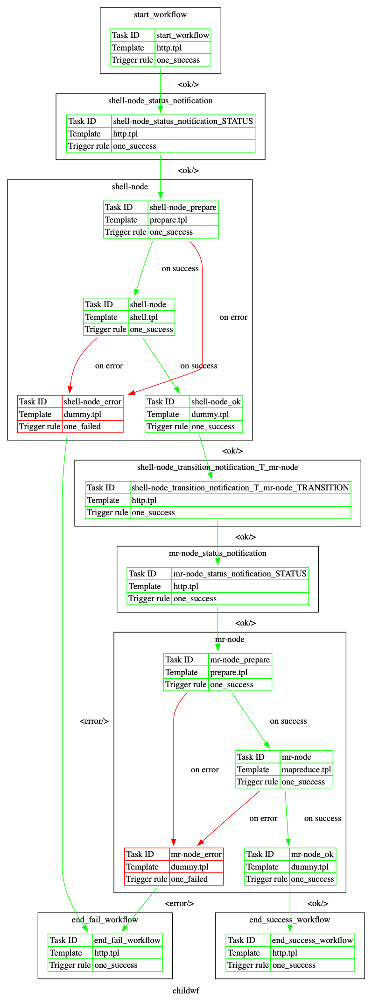

<!--
  Copyright 2019 Google LLC

  Licensed under the Apache License, Version 2.0 (the "License");
  you may not use this file except in compliance with the License.
  You may obtain a copy of the License at

  http://www.apache.org/licenses/LICENSE-2.0

  Unless required by applicable law or agreed to in writing, software
  distributed under the License is distributed on an "AS IS" BASIS,
  WITHOUT WARRANTIES OR CONDITIONS OF ANY KIND, either express or implied.
  See the License for the specific language governing permissions and
  limitations under the License.
-->
# Oozie to Airflow

[](https://codecov.io/gh/GoogleCloudPlatform/oozie-to-airflow)
[](https://github.com/ambv/black)
[](https://opensource.org/licenses/Apache-2.0)
[](https://pyup.io/repos/github/GoogleCloudPlatform/oozie-to-airflow/)

A tool to easily convert between [Apache Oozie](http://oozie.apache.org/) workflows
and [Apache Airflow](https://airflow.apache.org) workflows.

The program targets Apache Airflow >= 2.x and Apache Oozie 1.0 XML schema.

If you want to contribute to the project, please take a look at [CONTRIBUTING.md](CONTRIBUTING.md)

# Table of Contents

<!-- START doctoc generated TOC please keep comment here to allow auto update -->
<!-- DON'T EDIT THIS SECTION, INSTEAD RE-RUN doctoc TO UPDATE -->


- [Background](#background)
- [Running the Program](#running-the-program)
  - [Installing from PyPi](#installing-from-pypi)
  - [Installing from sources](#installing-from-sources)
  - [Running the conversion](#running-the-conversion)
  - [Structure of the application folder](#structure-of-the-application-folder)
  - [The o2a libraries](#the-o2a-libraries)
- [Supported Oozie features](#supported-oozie-features)
  - [Control nodes](#control-nodes)
  - [EL Functions](#el-functions)
  - [Workflow and node notifications](#workflow-and-node-notifications)
- [Airflow-specific optimisations](#airflow-specific-optimisations)
  - [Removing unnecessary control nodes](#removing-unnecessary-control-nodes)
  - [Removing inaccessible nodes](#removing-inaccessible-nodes)
- [Common Known Limitations](#common-known-limitations)
  - [File/Archive functionality](#filearchive-functionality)
  - [Not all global configuration methods are supported](#not-all-global-configuration-methods-are-supported)
  - [Support for uber.jar feature](#support-for-uberjar-feature)
  - [Support for .so and .jar lib files](#support-for-so-and-jar-lib-files)
  - [Custom messages missing for Kill Node](#custom-messages-missing-for-kill-node)
  - [Capturing output is not supported](#capturing-output-is-not-supported)
  - [Subworkflow DAGs must be placed in examples](#subworkflow-dags-must-be-placed-in-examples)
  - [EL functions support](#el-functions-support)
  - [Notification proxy is not supported](#notification-proxy-is-not-supported)
- [Cloud execution environment for Oozie to Airflow conversion](#cloud-execution-environment-for-oozie-to-airflow-conversion)
  - [Cloud environment setup](#cloud-environment-setup)
- [Examples](#examples)
  - [EL Example](#el-example)
  - [SSH Example](#ssh-example)
  - [Email Example](#email-example)
  - [MapReduce Example](#mapreduce-example)
  - [FS Example](#fs-example)
  - [Java Example](#java-example)
  - [Pig Example](#pig-example)
  - [Shell Example](#shell-example)
  - [Spark Example](#spark-example)
  - [Sub-workflow Example](#sub-workflow-example)
  - [DistCp Example](#distcp-example)
  - [Decision Example](#decision-example)
  - [Hive/Hive2 Example](#hivehive2-example)
  - [Demo Example](#demo-example)
  - [Childwf Example](#childwf-example)

<!-- END doctoc generated TOC please keep comment here to allow auto update -->

# Background

Apache Airflow is a workflow management system developed by AirBnB in 2014.
It is a platform to programmatically author, schedule, and monitor workflows.
Airflow workflows are designed as [Directed Acyclic Graphs](https://airflow.apache.org/tutorial.html#example-pipeline-definition)
(DAGs) of tasks in Python. The Airflow scheduler executes your tasks on an array of
workers while following the specified dependencies.

Apache Oozie is a workflow scheduler system to manage Apache Hadoop jobs.
Oozie workflows are also designed as [Directed Acyclic Graphs](https://oozie.apache.org/docs/3.1.3-incubating/DG_Overview.html)
(DAGs) in XML.

There are a few differences noted below:


|         | Spec.  | Task        | Dependencies                    | "Subworkflows" | Parameterization             | Notification        |
|---------|--------|-------------|---------------------------------|----------------|------------------------------|---------------------|
| Oozie   | XML    | Action Node | Control Node                    | Subworkflow    | EL functions/Properties file | URL based callbacks |
| Airflow | Python | Operators   | Trigger Rules, set_downstream() | SubDag         | jinja2 and macros            | Callbacks/Emails    |


# Running the Program

Note that you need Python >= 3.8 to run the converter.

## Installing from PyPi

You can install `o2a` from PyPi via `pip install o2a`. After installation, the
[o2a](bin/o2a) and [o2a-validate-workflows](bin/o2a-validate-workflows) should be available on your path.

## Installing from sources

1. (Optional) Install virtualenv:

    In case you use sources of `o2a`, the environment can be set up via the virtualenv setup
(you can create one using [virtualenvwrapper](https://virtualenvwrapper.readthedocs.io/en/latest/)
for example).

2. Install Oozie-to-Airflow - you have 2 options to do so:

    1. automatically: install `o2a` from local folder using `pip install -e .`

        This will take care about, among others, adding the [bin](bin) subdirectory to the PATH.

    2. more manually:

        1. While in your virtualenv, you can install all the requirements via `pip install -r requirements.txt`.

        2. You can add the [bin](bin) subdirectory to your
        PATH, then all the scripts below can be run without adding the `./bin` prefix.
        This can be done for example by adding a line similar to the one below to your `.bash_profile`
        or `bin/postactivate` from your virtual environment:

        ```bash
        export PATH=${PATH}:<INSERT_PATH_TO_YOUR_OOZIE_PROJECT>/bin
        ```

        Otherwise you need to run all the scripts from the bin subdirectory, for example:

        ```bash
        ./bin/o2a --help
        ```

In all the example commands below, it is assumed that the [bin](bin) directory is in your PATH -
either installed from PyPi or from the sources.

## Running the conversion

You can run the program by calling:
`o2a -i <INPUT_APPLICATION_FOLDER> -o <OUTPUT_FOLDER_PATH>`

Example:
`o2a -i examples/demo -o output/demo`

This is the full usage guide, available by running `o2a -h`

```
usage: o2a [-h] -i INPUT_DIRECTORY_PATH -o OUTPUT_DIRECTORY_PATH [-n DAG_NAME]
           [-u USER] [-s START_DAYS_AGO] [-v SCHEDULE_INTERVAL] [-d]

Convert Apache Oozie workflows to Apache Airflow workflows.

optional arguments:
  -h, --help            show this help message and exit
  -i INPUT_DIRECTORY_PATH, --input-directory-path INPUT_DIRECTORY_PATH
                        Path to input directory
  -o OUTPUT_DIRECTORY_PATH, --output-directory-path OUTPUT_DIRECTORY_PATH
                        Desired output directory
  -n DAG_NAME, --dag-name DAG_NAME
                        Desired DAG name [defaults to input directory name]
  -u USER, --user USER  The user to be used in place of all ${user.name}
                        [defaults to user who ran the conversion]
  -s START_DAYS_AGO, --start-days-ago START_DAYS_AGO
                        Desired DAG start as number of days ago
  -v SCHEDULE_INTERVAL, --schedule-interval SCHEDULE_INTERVAL
                        Desired DAG schedule interval as number of days
  -d, --dot             Renders workflow files in DOT format
```

## Structure of the application folder

The input application directory has to follow the structure defined as follows:

```
<APPLICATION>/
             |- job.properties        - job properties that are used to run the job
             |- hdfs                  - folder with application - should be copied to HDFS
             |     |- workflow.xml    - Oozie workflow xml (1.0 schema)
             |     |- ...             - additional folders required to be copied to HDFS
             |- configuration.template.properties - template of configuration values used during conversion
             |- configuration.properties          - generated properties for configuration values
```

## The o2a libraries

Converted Airflow DAGs use common libraries. Those libraries should be available on PYTHONPATH for all
Airflow components - scheduler, webserver and workers - so that they can be imported when DAGs are parsed.

Those libraries are in [o2a/o2a_libs](o2a/o2a_libs) folder and the easiest way to make them available to
all the DAGs is to install them from [PyPi](https://pypi.org/project/o2a-lib/) via `pip install o2a-lib`.


# Supported Oozie features

## Control nodes
### Fork and Join

A [fork node](https://oozie.apache.org/docs/5.2.0/WorkflowFunctionalSpec.html#a3.1.5_Fork_and_Join_Control_Nodes)
splits the path of execution into multiple concurrent paths of execution.

A [join node](https://oozie.apache.org/docs/5.2.0/WorkflowFunctionalSpec.html#a3.1.5_Fork_and_Join_Control_Nodes)
waits until every concurrent execution of the previous fork node arrives to it. The fork and join nodes must be used in pairs. The join node
assumes concurrent execution paths are children of the same fork node.
~~~~
<workflow-app name="[WF-DEF-NAME]" xmlns="uri:oozie:workflow:0.1">
    ...
    <fork name="[FORK-NODE-NAME]">
        <path start="[NODE-NAME]" />
        ...
        <path start="[NODE-NAME]" />
    </fork>
    ...
    <join name="[JOIN-NODE-NAME]" to="[NODE-NAME]" />
    ...
</workflow-app>
~~~~

### Decision

A [decision node](https://oozie.apache.org/docs/5.2.0/WorkflowFunctionalSpec.html#a3.1.4_Decision_Control_Node)
enables a workflow to make a selection on the execution path to follow.

The behavior of a decision node can be seen as a switch-case statement.

A decision node consists of a list of predicates-transition pairs plus a default transition. Predicates are evaluated in order or appearance until one of them evaluates to true and the corresponding transition is taken. If none of the predicates evaluates to true the default transition is taken.

Predicates are JSP Expression Language (EL) expressions (refer to section 4.2 of this document) that resolve into a boolean value, true or false . For example:
`${fs:fileSize('/usr/foo/myinputdir') gt 10 * GB}`

~~~~
<workflow-app name="[WF-DEF-NAME]" xmlns="uri:oozie:workflow:0.1">
    ...
    <decision name="[NODE-NAME]">
        <switch>
            <case to="[NODE_NAME]">[PREDICATE]</case>
            ...
            <case to="[NODE_NAME]">[PREDICATE]</case>
            <default to="[NODE_NAME]"/>
        </switch>
    </decision>
    ...
</workflow-app>
~~~~
### Start

The [start node](https://oozie.apache.org/docs/5.2.0/WorkflowFunctionalSpec.html#a3.1.1_Start_Control_Node)
is the entry point for a workflow job, it indicates the first workflow node the workflow job must transition to.

When a workflow is started, it automatically transitions to the node specified in the start .

A workflow definition must have one start node.

~~~~
<workflow-app name="[WF-DEF-NAME]" xmlns="uri:oozie:workflow:0.1">
  ...
  <start to="[NODE-NAME]"/>
  ...
</workflow-app>
~~~~
### End

The [end node](https://oozie.apache.org/docs/5.2.0/WorkflowFunctionalSpec.html#a3.1.2_End_Control_Node)
is the end for a workflow job, it indicates that the workflow job has completed successfully.

When a workflow job reaches the end it finishes successfully (SUCCEEDED).

If one or more actions started by the workflow job are executing when the end node is reached, the actions will be killed. In this scenario the workflow job is still considered as successfully run.

A workflow definition must have one end node.

~~~~
<workflow-app name="[WF-DEF-NAME]" xmlns="uri:oozie:workflow:0.1">
    ...
    <end name="[NODE-NAME]"/>
    ...
</workflow-app>
~~~~

### Kill

The [kill node](https://oozie.apache.org/docs/5.2.0/WorkflowFunctionalSpec.html#a3.1.3_Kill_Control_Node)
allows a workflow job to exit with an error.

When a workflow job reaches the kill it finishes in error (KILLED).

If one or more actions started by the workflow job are executing when the kill node is reached, the actions will be killed.

A workflow definition may have zero or more kill nodes.

~~~~
<workflow-app name="[WF-DEF-NAME]" xmlns="uri:oozie:workflow:0.1">
    ...
    <kill name="[NODE-NAME]">
        <message>[MESSAGE-TO-LOG]</message>
    </kill>
    ...
</workflow-app>
~~~~

## EL Functions

As of now, a very minimal set of [Oozie EL](https://oozie.apache.org/docs/5.2.0/WorkflowFunctionalSpec.html#a4.2_Expression_Language_Functions)
functions are supported. The way they work is that an EL expression is being translated to
a jinja template. The translation is performed using [Lark](https://lark-parser.readthedocs.io/en/latest/).
All required variables should be passed in `job.properties`. Equivalents of EL functions can be found in
`o2a_libs/functions.py`.

For example the following EL expression
```${wf:user() == firstNotNull(arg1, arg2)}```
is translated to the following jinja equivalent:
```{{functions.wf.user() == functions.first_not_null(arg1, arg2)}}```
and it requires that `job.properties` includes values for `arg1` and `arg2`.

This design allows for custom EL function mapping if one so chooses. By
default everything gets mapped to the module `o2a_libs.functions`. This means in
order to use EL function mapping, the folder `o2a_libs.functions` should
be copied over to the Airflow DAG folder. This should then be picked up and
parsed by the Airflow workers and then available to all DAGs.

## Workflow and node notifications

Workflow jobs can be configured to make an HTTP GET notification upon start and end of a workflow action node
and upon the start and completion of a workflow job. More information in [Oozie docs](https://oozie.apache.org/docs/5.2.0/WorkflowFunctionalSpec.html#a5_Workflow_Notifications).

Oozie-to-Airflow supports this feature.
The `job.properties` file has contain URLs for workflow and action node notifications - example below:

```
oozie.wf.workflow.notification.url=http://example.com/workflow?job-id=$jobId&status=$status
oozie.wf.action.notification.url=http://example.com/action?job-id=$jobId&node-name=$nodeName&status=$status
```

If they are present, Oozie-to-Airflow will insert additional `BashOperator` to the generated DAG
for each notification to be sent, right before or after the appropriate node (for node notifications) or at the beginning or end
of the workflow (for workflow notifications).
Inside the `BashOperator` will use `curl` to send an HTTP GET request to the appropriate URL endpoint.

Example DAG without notifications:



The same DAG with notifications:



# Airflow-specific optimisations

Due to the fact that Oozie and Airflow differ with regards to some aspects of running workflows,
there may be some differences in the output Airflow DAG with regards to the Oozie XML.

## Removing unnecessary control nodes

In Airflow you don't need as many explicit control nodes as in Oozie. For example you don't ever need a Start
node and in most cases End is also not needed.

We introduced the concept of `Transformers` in O2A, which modify the workflow. Below are the ones that
remove unnecessary control nodes:

- `RemoveEndTransformer` - removes End nodes with all relations when it's not connected to a Decision node,
- `RemoveKillTransformer` - removes Kill nodes with all relations when it's not connected to a Decision node,
- `RemoveStartTransformer` - removes Start nodes with all relations,
- `RemoveForkTransformer` - removes Fork nodes when there are no upstream nodes,
- `RemoveJoinTransformer` - removes Join nodes when there are no downstream nodes.

## Removing inaccessible nodes

In Oozie for a node to be executed it has to be able to be traced back to the Start node.
If a node is "loose" and is not connected to Start in any way (directly or indirectly via its "parents") it
will be skipped.

However in Airflow all tasks will be executed. Therefore in order to replicate the "skipping" of loose nodes
behaviour of Oozie we need to remove nodes unconnected to Start during the conversion phase.

This is achieved thanks to the `RemoveInaccessibleNodeTransformer`.

# Common Known Limitations

There are few limitations in the implementation of the Oozie-To-Airflow converter. It's not possible to
write a converter that handles all cases of complex workflows from Ooozie because some of
functionalities available are not possible to map easily to existing Airflow Operators or
cannot be tested because of the current Dataproc + Composer limitations. Some of those limitations
might be removed in the future. Below is a list of common known limitations that we are aware of for now.

Many of those limitations are not blockers - the workflows will still be converted to Python DAGs
and it should be possible to manually (or automatically) post-process the DAGs to add custom
functionality. So even with those limitations in place you can still save a ton of work when
converting many Oozie workflows.

In the following, "Examples" section more specific per-action limitations are listed as well.

## File/Archive functionality

At the time of this writing we were not able to determine if file/archive
functionality works as intended. While we map appropriate file/archive methods it seems that Oozie
treats file/archive somewhat erraticaly. This is not a blocker to run most of the operations, however
some particular complex workflows might be problematic. Further testing with real, production Oozie
workflows is needed to verify our implementation.

[Example Oozie docs](https://oozie.apache.org/docs/5.2.0/WorkflowFunctionalSpec.html#a3.2.2.1_Adding_Files_and_Archives_for_the_Job)

* [File/Archive in Pig doesn't work](https://github.com/GoogleCloudPlatform/oozie-to-airflow/issues/243)

## Not all global configuration methods are supported

Oozie implements a number of ways how configuration parameters are passed to actions. Out of the existing
configuration options the following ones are not supported (but can be easily added as needed):

* [The config-default.xml file](https://github.com/GoogleCloudPlatform/oozie-to-airflow/issues/137)
* [Parameters section of workflow.xml](https://github.com/GoogleCloudPlatform/oozie-to-airflow/issues/138)
* [Handle Global configuration properties](https://github.com/GoogleCloudPlatform/oozie-to-airflow/issues/134)

## Support for uber.jar feature

The uber.jar feature is not supported. [Oozie docs](https://oozie.apache.org/docs/5.2.0/WorkflowFunctionalSpec.html#AppDeployment)

* [Support uber.jar feature](https://github.com/GoogleCloudPlatform/oozie-to-airflow/issues/140)

## Support for .so and .jar lib files

Oozie adds .so and .jar files from the lib folder to Local Cache for all the jobs run to
LD_LIBRARY_PATH/CLASSPATH. Currently only Java Mapper supports it.

* [Support for Oozie lib .so files](https://github.com/GoogleCloudPlatform/oozie-to-airflow/issues/302)
* [Support for Oozie lib .jar files](https://github.com/GoogleCloudPlatform/oozie-to-airflow/issues/301)

## Custom messages missing for Kill Node

The Kill Node might have custom log message specified. This is not implemented.
[Oozie docs](https://oozie.apache.org/docs/5.2.0/WorkflowFunctionalSpec.html#a3.1.3_Kill_Control_Node)

* [Add handling of custom Kill Node message](https://github.com/GoogleCloudPlatform/oozie-to-airflow/issues/97)

## Capturing output is not supported

In several actions you can capture output from tasks. This is not yet implemented.
[Example Oozie docs](https://oozie.apache.org/docs/5.2.0/WorkflowFunctionalSpec.html#a3.2.6_Java_Action)

* [Add support for capture-ouput](https://github.com/GoogleCloudPlatform/oozie-to-airflow/issues/155)

## Subworkflow DAGs must be placed in examples

Currently all subworkflow DAGs must be in examples folder

* [Subworkflow conversion expects to be run in examples](https://github.com/GoogleCloudPlatform/oozie-to-airflow/issues/213)

## EL functions support

Currently many EL-functions are implemented (basic functions, fs functions and subset od wf functions).
Check this [document](https://docs.google.com/spreadsheets/d/1lQJ101GDEkXyzKmB8l9nESao6CF9G_1qCURdcqmQ0uA/edit?usp=sharing)
for full information about current state. The following `wf:functions` are not implemented:

* [`wf:actionTrackerUri`](https://github.com/GoogleCloudPlatform/oozie-to-airflow/issues/372)
* [`wf:actionExternalId`](https://github.com/GoogleCloudPlatform/oozie-to-airflow/issues/371)
* [`wf:actionData`](https://github.com/GoogleCloudPlatform/oozie-to-airflow/issues/370)
* [`wf:run`](https://github.com/GoogleCloudPlatform/oozie-to-airflow/issues/369)
* [`wf:errorMessage`](https://github.com/GoogleCloudPlatform/oozie-to-airflow/issues/368)
* [`wf:errorCode`](https://github.com/GoogleCloudPlatform/oozie-to-airflow/issues/367)
* [`wf:transition`](https://github.com/GoogleCloudPlatform/oozie-to-airflow/issues/366)
* [`wf:callback`](https://github.com/GoogleCloudPlatform/oozie-to-airflow/issues/365)
* [`wf:group`](https://github.com/GoogleCloudPlatform/oozie-to-airflow/issues/364)
* [`wf:appPath`](https://github.com/GoogleCloudPlatform/oozie-to-airflow/issues/363)
* [Hadoop Counters](https://github.com/GoogleCloudPlatform/oozie-to-airflow/issues/392)

All implemented function could be found in [o2a_libs](https://github.com/GoogleCloudPlatform/oozie-to-airflow/tree/master/o2a/o2a_libs)
module. Camel case names of Oozie functions were substituted with snake case equivalents (ex. lastErrorNode becomes
last_error_node).

Additionally some already implemented functions may not preserve the full logic of the original EL-expression
due to differences between Oozie and Airflow. It's difficult to implement it in generic-enough way to cover
all possible cases, it's much easier to eave the implementation of those functions to the user.
It's perfectly possible to provide your own implementation of each of those functions if you need
to customise it and in many cases it will be easier if it's specific implementation rather than generic one.

## Notification proxy is not supported

In Oozie, the `oozie.wf.workflow.notification.proxy` property can be used to configure proxy,
through which notifications will be sent.

This is not supported. Currently notifications will be sent directly, without proxy.

# Cloud execution environment for Oozie to Airflow conversion

## Cloud environment setup

An easy way of running the workflows of Oozie as well as running the oozie-to-airflow converted DAGs in
Airflow is by using Cloud Composer and Dataproc in GCP. This the environment supported currently by the
converter and one that it was heavily tested with. These services allow testing without much need for an
on-premise setup. Here are some details about the environment that is supported:

### Cloud Composer

* composer-2.2.0-airflow-2.5.1
* python version 3 (3.8.10)
* machine n1-standard-1
* node count: 3
* Additional PyPi packages:
    * sshtunnel==0.1.4

### Cloud Dataproc Cluster with Oozie

* n1-standard-2, 4 vCPU, 20 GB memory (! Minimum 16 GB RAM needed)
* primary disk size, 50 GB
* Image 1.3.29-debian9
* Hadoop version
* Init action: [oozie-5.2.sh](dataproc/oozie-5.2.sh)

Those are the steps you should follow to set it up:

1. Create a Dataproc cluster see [Creating Dataproc Cluster](#creating-dataproc-cluster) below
1. Create a [Cloud Composer Environment](https://cloud.google.com/composer/docs/how-to/managing/creating#creating_a_new_environment)
   with at least Airflow version 2.0 to test the Apache Airflow workflows.
1. Set up all required [Airflow Connections](https://airflow.apache.org/howto/connection/index.html)
   in Composer. This is required for things like `SSHOperator`.

### Creating Dataproc cluster

We prepared Dataproc [initialization action](https://cloud.google.com/dataproc/docs/concepts/configuring-clusters/init-actions)
that allows to run Oozie 5.2.0 on Dataproc.

Please upload [oozie-5.2.sh](dataproc/oozie-5.2.sh) to your GCS bucket and create cluster using following command:

Note that you need at least 20GB RAM to run Oozie jobs on the cluster. The custom machine type below has enough RAM
to handle oozie.

```bash
gcloud dataproc clusters create <CLUSTER_NAME> --region europe-west1 --subnet default --zone "" \
     --single-node --master-machine-type custom-4-20480 --master-boot-disk-size 500 \
     --image-version 1.3-deb9 --project <PROJECT_NAME> --initialization-actions 'gs://<BUCKET>/<FOLDER>/oozie-5.1.sh' \
     --initialization-action-timeout=30m
```

**Note 1:** it might take ~20 minutes to create the cluster
**Note 2:** the init-action works only with
  [single-node cluster](https://cloud.google.com/dataproc/docs/concepts/configuring-clusters/single-node-clusters)
  and Dataproc 1.3

Once cluster is created, steps from [example map reduce job](dataproc/example-map-reduce-job.sh) can be
run on master node to execute Oozie's example Map-Reduce job.

Oozie is serving web UI on port 11000. To enable access to it please follow
[official instructions](https://cloud.google.com/dataproc/docs/concepts/accessing/cluster-web-interfaces)
on how to connect to the cluster web interfaces.

List of jobs with their statuses can be also shown by issuing `oozie jobs` command on master node.

More about testing the Oozie to Airflow conversion process can be found in
[CONTRIBUTING.md](CONTRIBUTING.md#running-system-tests)

# Examples

All examples can be found in the [examples](examples) directory.

* [EL](#el-example)
* [SSH](#ssh-example)
* [Email](#email-example)
* [MapReduce](#mapreduce-example)
* [FS](#fs-example)
* [Java](#java-example)
* [Pig](#pig-example)
* [Shell](#shell-example)
* [Spark](#spark-example)
* [Sub-workflow](#sub-workflow-example)
* [DistCp](#distcp-example)
* [Decision](#decision-example)
* [Hive/Hive2](#hivehive2-example)
* [Demo](#demo-example)
* [Child workflow](#childwf-example)

## EL Example

### Running

The Oozie Expression Language (EL) example can be run as:
`o2a -i examples/el -o output/el`

This will showcase the ability to use the [o2a/o2a_libs](o2a/o2a_libs) folder to map EL functions
to Python methods. This example assumes that the user has a valid Apache Airflow
SSH connection set up and the [o2a/o2a_libs](o2a/o2a_libs) folder has been copied to the dags
folder (preserving o2a parent directory).

Please keep in mind that as of the current version only a single EL variable
or single EL function. Variable/function chaining is not currently supported.

### Output
In this example the output will be created in the `./output/el/` folder.

### Known limitations

Decision example is not yet fully functional as EL functions are not yet fully implemented so condition is
hard-coded for now. Once EL functions are implemented, the condition in the example will be updated.

Github issue: [Implement decision node](https://github.com/GoogleCloudPlatform/oozie-to-airflow/issues/42)


## SSH Example

### Prerequisites

In order to change the `user` or `host` in the example, please edit the
`examples/ssh/hdfs/workflow.xml`.

### Running

The ssh example can be run as:

`o2a -i examples/ssh -o output/ssh`

This will convert the specified Oozie XML and write the output into the
specified output directory, in this case `output/ssh/ssh.py`.

There are some differences between Apache Oozie and Apache Airflow as far as the SSH specification goes.
In Airflow you will have to add/edit an SSH-specific connection that contains
the credentials required for the specified SSH action. For example, if
the SSH node looks like:
```xml
<action name="ssh">
    <ssh xmlns="uri:oozie:ssh-action:0.1">
        <host>user@apache.org</host>
        <command>echo</command>
        <args>"Hello Oozie!"</args>
    </ssh>
    <ok to="end"/>
    <error to="fail"/>
</action>
```
Then the default Airflow SSH connection, `ssh_default` should have at
the very least a password set. This can be found in the Airflow Web UI
under **Admin > Connections**. From the command line it is impossible to
edit connections so you must add one like:

`airflow connections --add --conn_id <SSH_CONN_ID> --conn_type SSH --conn_password <PASSWORD>`

More information can be found in [Airflow's documentation](https://airflow.apache.org/cli.html#connections).

### Output
In this example the output will be created in the `./output/ssh/` folder.

The converted DAG uses the `SSHOperator` in Airflow.

### Known limitations

No known limitations.


## Email Example

### Prerequisites

Make sure to first copy `/examples/email/configuration.template.properties`, rename it as
`configuration.properties` and fill in with configuration data.

### Running

The Email example can be run as:

`o2a -i examples/email -o output/email`

### Output
In this example the output will be created in the `./output/email/` folder.

The converted DAG uses the `EmailOperator` in Airflow.

### Prerequisites
In Oozie the SMTP server configuration is located in `oozie-site.xml`.

For Airflow it needs to be located in `airflow.cfg`.
Example Airflow SMTP configuration:
```
[email]
email_backend = airflow.utils.email.send_email_smtp

[smtp]
smtp_host = example.com
smtp_starttls = True
smtp_ssl = False
smtp_user = airflow_user
smtp_password = password
smtp_port = 587
smtp_mail_from = airflow_user@example.com
```

For more information on setting Airflow configuration options
[see here](https://airflow.readthedocs.io/en/stable/howto/set-config.html).

### Known limitations

**1. Attachments are not supported**

Due to the complexity of extracting files from HDFS inside Airflow and providing them
for the `EmailOperator`, the functionality of sending attachments has not yet been
implemented.

*Solution:* Implement in O2A a mechanism to extract a file from HDFS inside Airflow.

Github Issue: [Add support for attachment in Email mapper](https://github.com/GoogleCloudPlatform/oozie-to-airflow/issues/335)

**2. `<content_type>` tag is not supported**

From Oozie docs:
> From uri:oozie:email-action:0.2 one can also specify mail content type as
<content_type>text/html</content_type>. “text/plain” is default.

Unfortunately, currently the `EmailOperator` only accepts the `mime_subtype` parameter.
However it only works for multipart subtypes, as the operator appends the subtype
to the `multipart/` prefix. Therefore passing either `html` or `plain` from Oozie makes no sense.

As a result the email will always be sent with the `EmailOperator`'s default Content-Type value,
which is `multipart/mixed`.

*Solution:* Modify the Airflow's `EmailOperator` to support more
content types.

Github Issue: [Content type support in Email mapper](https://github.com/GoogleCloudPlatform/oozie-to-airflow/issues/343)

**3. `cc` and `bcc` fields are not templated in EmailOperator**

Only the 'to', 'subject' and 'html_content' fields in EmailOperator are templated.
In practice this covers all fields of an Oozie email action node apart from `cc` and `bcc`.

Therefore if there is an EL function in the action node in either of these two fields
which will require a Jinja expression in Airflow, it will not work - the expression will
not be executed, but rather treated as a plain string.

*Solution:* Modify the Airflow's `EmailOperator` to mark more fields as
`template_fields`.

Github Issue: [The CC: and BCC: fields are not templated in EmailOperator](https://github.com/GoogleCloudPlatform/oozie-to-airflow/issues/344)


## MapReduce Example

### Prerequisites

Make sure to first copy `examples/mapreduce/configuration.template.properties`, rename it as
`configuration.properties` and fill in with configuration data.

### Running

The MapReduce example can be run as:

`o2a -i examples/mapreduce -o output/mapreduce`

### Output
In this example the output will be created in the `./output/mapreduce/` folder.

The converted DAG uses the `DataProcHadoopOperator` in Airflow.

### Known limitations

**1. Exit status not available**

From the [Oozie documentation](https://oozie.apache.org/docs/5.2.0/WorkflowFunctionalSpec.html#a3.2.2_Map-Reduce_Action):
> The counters of the Hadoop job and job exit status (FAILED, KILLED or SUCCEEDED) must be available to the
workflow job after the Hadoop jobs ends. This information can be used from within decision nodes and other
actions configurations.

Currently we use the `DataProcHadoopOperator` which does not store the job exit status in an XCOM for other tasks to use.

Issue in Github: [Implement exit status and counters in MapReduce Action](https://github.com/GoogleCloudPlatform/oozie-to-airflow/issues/337)

**2. Configuration options**

From the [Oozie documentation](https://oozie.apache.org/docs/5.2.0/WorkflowFunctionalSpec.html#a3.2.2_Map-Reduce_Action)
(the strikethrough is from us):
> Hadoop JobConf properties can be specified as part of
> - ~~the config-default.xml or~~
> - ~~JobConf XML file bundled with the workflow application or~~
> - ~~\<global> tag in workflow definition or~~
> - Inline map-reduce action configuration or
> - ~~An implementation of OozieActionConfigurator specified by the <config-class> tag in workflow definition.~~

Currently the only supported way of configuring the map-reduce action is with the
inline action configuration, i.e. using the `<configuration>` tag in the workflow's XML file definition.

Issues in Github:
* [Add support for config-default.xml](https://github.com/GoogleCloudPlatform/oozie-to-airflow/issues/137)
* [Add support for parameters section of the workflow.xml](https://github.com/GoogleCloudPlatform/oozie-to-airflow/issues/138)
* [Handle global configuration properties](https://github.com/GoogleCloudPlatform/oozie-to-airflow/issues/134)

**3. Streaming and pipes**

Streaming and pipes are currently not supported.

Issue in github [Implement streaming support](https://github.com/GoogleCloudPlatform/oozie-to-airflow/issues/336)

## FS Example

### Prerequisites

Make sure to first copy `examples/fs/configuration.template.properties`, rename it as
`configuration.properties` and fill in with configuration data.

### Running

The FS example can be run as:

`o2a -i examples/fs -o output/fs`

### Output
In this example the output will be created in the `./output/fs/` folder.

The converted DAG uses the `BashOperator` in Airflow.

### Known limitations

Not all FS operations are currently idempotent. It's not a problem if prepare action is used in other tasks
but might be a problem in certain situations. Fixing the operators to be idempotent requires more complex
logic and support for Pig actions is missing currently.

Issue in Github: [FS Mapper and idempotence](https://github.com/GoogleCloudPlatform/oozie-to-airflow/issues/175)

The dirFiles are not supported in FSMapper.

Issue in Github: [Add support for dirFiles in FsMapper](https://github.com/GoogleCloudPlatform/oozie-to-airflow/issues/80)

## Java Example

### Prerequisites

Make sure to first copy `examples/fs/configuration.template.properties`, rename it as
`configuration.properties` and fill in with configuration data.

### Running

The Java example can be run as:

`o2a -i examples/java -o output/java`

### Output
In this example the output will be created in the `./output/java/` folder.

The converted DAG uses the `DataProcHadoopOperator` in Airflow.

### Known limitations

1. Overriding action's Main class via `oozie.launcher.action.main.class` is not implemented.

Issue in Github: [Override Java main class with property](https://github.com/GoogleCloudPlatform/oozie-to-airflow/issues/338)

## Pig Example

### Prerequisites

Make sure to first copy `examples/pig/configuration.template.properties`, rename it as
`configuration.properties` and fill in with configuration data.

### Running

The Pig example can be run as:

`o2a -i examples/pig -o output/pig`

### Output
In this example the output will be created in the `./output/pig/` folder.

The converted DAG uses the `DataProcPigOperator` in Airflow.

### Known limitations
**1. Configuration options**

From the [Oozie documentation](https://oozie.apache.org/docs/5.2.0/WorkflowFunctionalSpec.html#a3.2.3_Pig_Action)
(the strikethrough is from us):
> Hadoop JobConf properties can be specified as part of
> - ~~the config-default.xml or~~
> - ~~JobConf XML file bundled with the workflow application or~~
> - ~~\<global> tag in workflow definition or~~
> - Inline pig action configuration.

Currently the only supported way of configuring the pig action is with the
inline action configuration, i.e. using the `<configuration>` tag in the workflow's XML file definition.

Issues in Github:
* [Add support for config-default.xml](https://github.com/GoogleCloudPlatform/oozie-to-airflow/issues/137)
* [Add support for parameters section of the workflow.xml](https://github.com/GoogleCloudPlatform/oozie-to-airflow/issues/138)
* [Handle global configuration properties](https://github.com/GoogleCloudPlatform/oozie-to-airflow/issues/134)


## Shell Example

### Prerequisites

Make sure to first copy `examples/shell/configuration.template.properties`, rename it as
`configuration.properties` and fill in with configuration data.

### Running

The Shell example can be run as:

`o2a -i examples/shell -o output/shell`

### Output
In this example the output will be created in the `./output/shell/` folder.

The converted DAG uses the `BashOperator` in Airflow, which executes the desired shell
action with Pig by invoking `gcloud dataproc jobs submit pig --cluster=<cluster> --region=<region>
--execute 'sh <action> <args>'`.

### Known limitations

**1. Exit status not available**

From the [Oozie documentation](https://oozie.apache.org/docs/5.2.0/DG_ShellActionExtension.html):
> The output (STDOUT) of the Shell job can be made available to the workflow job after the Shell job ends.
This information could be used from within decision nodes.

Currently we use the `BashOperator` which can store only the last line of the job output in an XCOM.
In this case the line is not helpful as it relates to the Dataproc job submission status and
not the Shell action's result.

Issue in Github: [Finalize shell mapper](https://github.com/GoogleCloudPlatform/oozie-to-airflow/issues/50)

**2. No Shell launcher configuration**

From the [Oozie documentation](https://oozie.apache.org/docs/5.2.0/DG_ShellActionExtension.html):
> Shell launcher configuration can be specified with a file, using the job-xml element, and inline,
using the configuration elements.

Currently there is no way specify the shell launcher configuration (it is ignored).

Issue in Github: [Shell Launcher Configuration](https://github.com/GoogleCloudPlatform/oozie-to-airflow/issues/340)

## Spark Example

### Prerequisites

Make sure to first copy `/examples/spark/configuration.template.properties`, rename it as
`configuration.properties` and fill in with configuration data.

### Running

The Spark example can be run as:

`o2a -i examples/spark -o output/spark`

### Output
In this example the output will be created in the `./output/spark/` folder.

The converted DAG uses the `DataProcSparkOperator` in Airflow.

### Known limitations

**1. Only tasks written in Java are supported**

From the [Oozie documentation](https://oozie.apache.org/docs/5.2.0/DG_ShellActionExtension.html):
> The jar element indicates a comma separated list of jars or python files.

The solution was tested with only a single Jar file.

**2. No Spark launcher configuration**

From the [Oozie documentation](https://oozie.apache.org/docs/5.2.0/DG_SparkActionExtension.html):
> Shell launcher configuration can be specified with a file, using the job-xml element, and inline,
using the configuration elements.

Currently there is no way to specify the Spark launcher configuration (it is ignored).

**3. Not all elements are supported**

The following elements are not supported: `job-tracker`, `name-node`, `master`, `mode`.

## Sub-workflow Example

### Prerequisites

Make sure to first copy `examples/subwf/configuration.template.properties`, rename it as
`configuration.properties` and fill in with configuration data.

### Running

The Sub-workflow example can be run as:

`o2a -i examples/subwf -o output/subwf`

### Output
In this example the output (together with sub-worfklow dag) will be created in the `./output/subwf/` folder.

The converted DAG uses the `SubDagOperator` in Airflow.

### Known limitations

No known limitations.

## DistCp Example

### Prerequisites

Make sure to first copy `examples/distcp/configuration.template.properties`, rename it as
`configuration.properties` and fill in with configuration data.

### Running

The DistCp example can be run as:

`o2a -i examples/distcp -o output/distcp`

### Output
In this example the output will be created in the `./output/distcp/` folder.

The converted DAG uses the `BashOperator` in Airflow, which submits the Hadoop DistCp job using the
`gcloud dataproc jobs submit hadoop` command.

### Known limitations

The system test of the example run with Oozie fails due to unknown reasons. The converted DAG run by Airflow
completes successfully.

## Decision Example

### Prerequisites

Make sure to first copy `examples/decision/configuration.template.properties`, rename it as
`configuration.properties` and fill in with configuration data.

### Running

The decision example can be run as:

`o2a -i examples/decision -o output/decision`

### Output
In this example the output will be created in the `./output/decision/` folder.

The converted DAG uses the `BranchPythonOperator` in Airflow.

### Known limitations

Decision example is not yet fully functional as EL functions are not yet fully implemented so condition is
hard-coded for now. Once EL functions are implemented, the condition in the example will be updated.

Github issue: [Implement decision node](https://github.com/GoogleCloudPlatform/oozie-to-airflow/issues/42)


## Hive/Hive2 Example

### Prerequisites

Make sure to first copy `/examples/hive/configuration.template.properties`, rename it as
`configuration.properties` and fill in with configuration data.

### Running

The Hive example can be run as:

`o2a -i examples/hive -o output/hive`

### Output
In this example the output will be created in the `./output/hive/` folder.

The converted DAG uses the `DataProcHiveOperator` in Airflow.

### Known limitations

**1. Only the connection to the local Hive instance is supported.**

Connection configuration options are not supported.


**2. Not all elements are supported**

For Hive, the following elements are not supported: `job-tracker`, `name-node`.
For Hive2, the following elements are not supported: `job-tracker`, `name-node`, `jdbc-url`, `password`.

The Github issue for both problems: [Hive connection configuration and other elements](https://github.com/GoogleCloudPlatform/oozie-to-airflow/issues/342)


## Demo Example

The demo example contains several action and control nodes. The control
nodes are `fork`, `join`, `decision`, `start`, `end`, and `kill`. As far as action
nodes go, there are `fs`, `map-reduce`, and `pig`.

Most of these are already supported, but when the program encounters a node it does
not know how to parse, it will perform a sort of "skeleton transformation" -
it will convert all the unknown nodes to dummy nodes. This will
allow users to manually parse the nodes if they so wish as the control flow
is there.

### Prerequisites

Make sure to first copy `examples/demo/configuration.template.properties`, rename it as
`configuration.properties` and fill in with configuration data.

### Running

The demo can be run as:

`o2a -i examples/demo -o output/demo`

This will parse and write to an output file in the `output/demo` directory.

### Known limitations

The decision node is not fully functional as there is not currently
 support for all EL functions. So in order for it to run in Airflow you may need to
edit the Python output file and change the decision node expression.

Issue in GitHub: [Implement decision node](https://github.com/GoogleCloudPlatform/oozie-to-airflow/issues/42)

### Output
In this example the output (including sub-workflow dag) will be created in the `./output/demo/` folder.

## Childwf Example

### Prerequisites

Make sure to first copy `examples/subwf/configuration.template.properties`, rename it as
`configuration.properties` and fill in with configuration data.

### Running

The childwf example is sub-workflow for the `demo` example. It can be run as:

`o2a -i examples/childwf -o output/childwf`

### Output
In this example the output will be created in the `./output/childwf/` folder.

### Known limitations

No known limitations.
